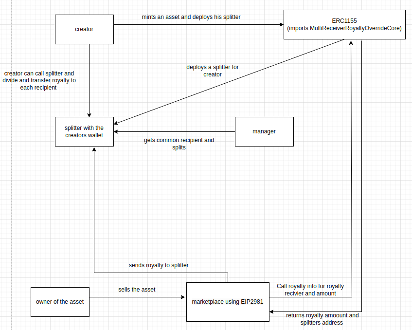
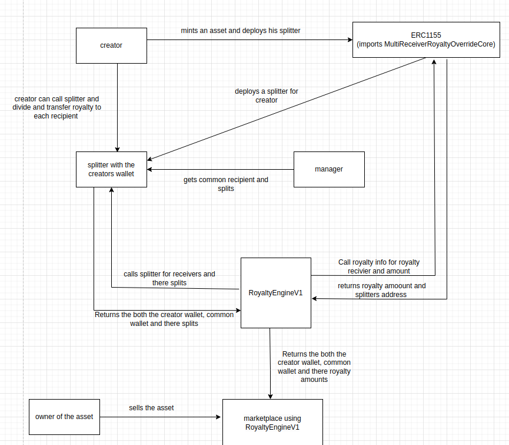

# poc-royalties-contracts

Implementation of a custom royalty distribution solution based on manifolds [royalty registry](https://github.com/manifoldxyz/royalty-registry-solidity)

# Requirements

To split the royalty between the creator and a common recipient .

Develop a Manager contract where we could set the royalty division ration in the future.

Develop a custom splitter with respect to the one used by [manifolds](https://github.com/manifoldxyz/royalty-registry-solidity/blob/main/contracts/overrides/RoyaltySplitter.sol). This custom splitter will call sand registry contract to get the creator split, sand's wallet and sand's split from sand registry contract.

Develop a custom MultiReceiverRoyaltyOverrideCloneable contact like this one from [manifolds](https://github.com/manifoldxyz/royalty-registry-solidity/blob/main/contracts/overrides/MultiReceiverRoyaltyOverrideCloneable.sol). This would be inherited by the ERC1155 contract such that a creator will deploy a single custom splitter to get their share of royalty.

# Architecture

## Royalty distribution through EIP2981

- Creator when minting an asset deploys a splitter with his wallet address
- The splitter gets the common recipient wallet address and shares of royalty from the manager contract.
- When that asset is sold on a market place which distributes EIP2981 royalty it calls the ERC1155 contract royaltyInfo function to get the Royalty receiver wallet and royalty amount.
- The royalty receiver wallet is the address of the splitter which would receive royalty.
- The creator or the common recipient from the manager can call the splitter to split the royalty between them.
- The Naive token Like ETH is split automatically

## Royalty distribution through manifold's RoyaltyEngineV1.

- Creator when minting an asset deploys a splitter with his wallet address
- The splitter gets the common recipient wallet address and shares of royalty from the manager contract.
- When that asset is sold on a market place which distributes royalty through manifolds Royalty Engine. Royalty Engine calls the ERC1155 contract royaltyInfo function to get the Royalty receiver wallet and royalty amount.

- Royalty engine checks if the royalty recipient is a splitter contract. It gets all the recipients from the splitter and distribute the royalty according to there share.
